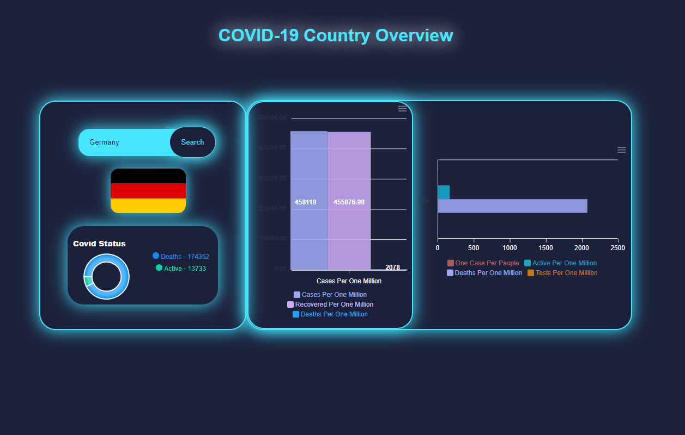

# COVID-19 Data Visualization

<h3>Visit: https://covid19-stats-react-app.netlify.app/</h3>

## Description:

This is a React-based web application that visualizes COVID-19 data for different countries using charts and graphs.

## Overview:

The COVID-19 Data Visualization application provides users with the ability to view COVID-19 statistics for different countries. The application fetches data from the "Corona LMAO API" to display the latest information about cases, deaths, active cases, recoveries, and other related metrics. Users can search for specific countries and view the corresponding data on various types of charts.

## Functionality and Components

The application is divided into three main chart components:

### 1. Area Chart

The Area Chart component displays the number of deaths and active cases for the selected country using a donut chart. Users can enter a country name in the input field and either press Enter or click the "Search" button to update the chart with the data for the specified country.

### 2. Bar Chart

The Bar Chart component shows the following COVID-19 metrics for the selected country using horizontal bars:

- One Case Per People
- Active Per One Million
- Deaths Per One Million
- Tests Per One Million

The bar chart provides a visual representation of these metrics to help users compare different aspects of the COVID-19 situation in the selected country.

### 3. Line Chart

The Line Chart component presents data on the following metrics for the selected country:

- Cases Per One Million
- Recovered Per One Million
- Deaths Per One Million

These metrics are plotted on a vertical bar chart, allowing users to observe trends and changes in the selected country's COVID-19 statistics.

## Styling

The application uses custom CSS styles to create a visually appealing and user-friendly interface. The background color and gradient provide a calming and attractive backdrop, while the charts and graphs are neatly arranged in a centered and responsive layout.

## Usage

To use the application, follow these steps:

1. Enter the name of the country you want to view data for in the input field.
2. Press Enter or click the "Search" button to fetch and display the data for the selected country.
3. Observe the Area Chart, Bar Chart, and Line Chart to view different aspects of the COVID-19 data for the chosen country.

Please note that the data is fetched from an external API, and the accuracy and availability of the information depend on the API's data sources.

## Credits

The COVID-19 Data Visualization application uses the "Corona LMAO API" to retrieve COVID-19 data for different countries. The charts and graphs are created using the "React ApexCharts" library, which provides powerful and customizable chart components for React applications.

## Development and Contributions

This application is an open-source project, and contributions from the community are welcome. If you find any issues or have suggestions for improvements, please feel free to create a pull request or open an issue on the project's GitHub repository.

Developed by [A-okmen](https://github.com/aokmen)

